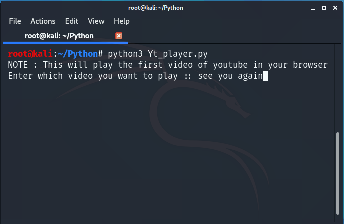

# youtube_player-python

## Libraries used : pywhatkit

     For Windows : python -m pip install pywhatkit
     
     
     For Linux   : pip3 install pywhatkit

#### For more such repositories visit [here](https://github.com/chinmay29hub/ "More in python")

### OUTPUT ::::::
   
   
   1)
   
   
   
   
  
   
   
   
   2)
   
   
   
   

